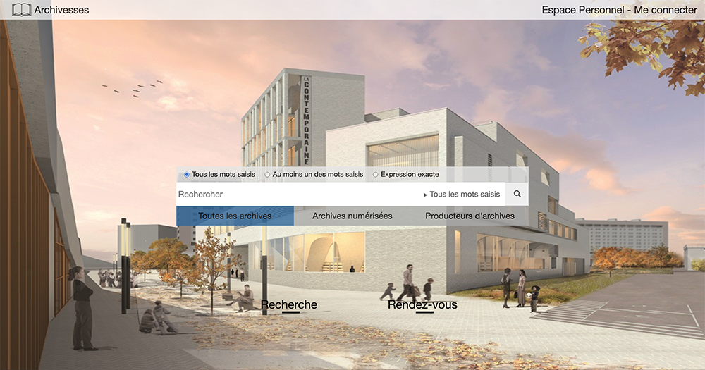
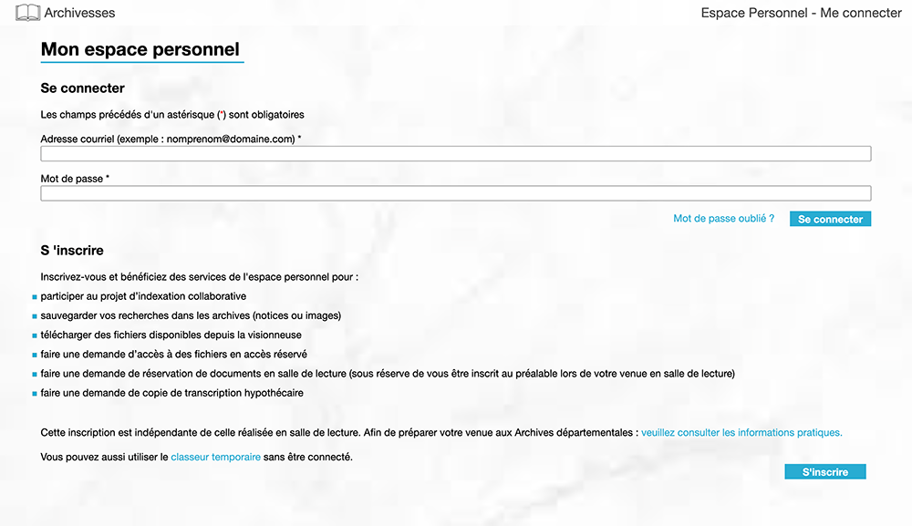
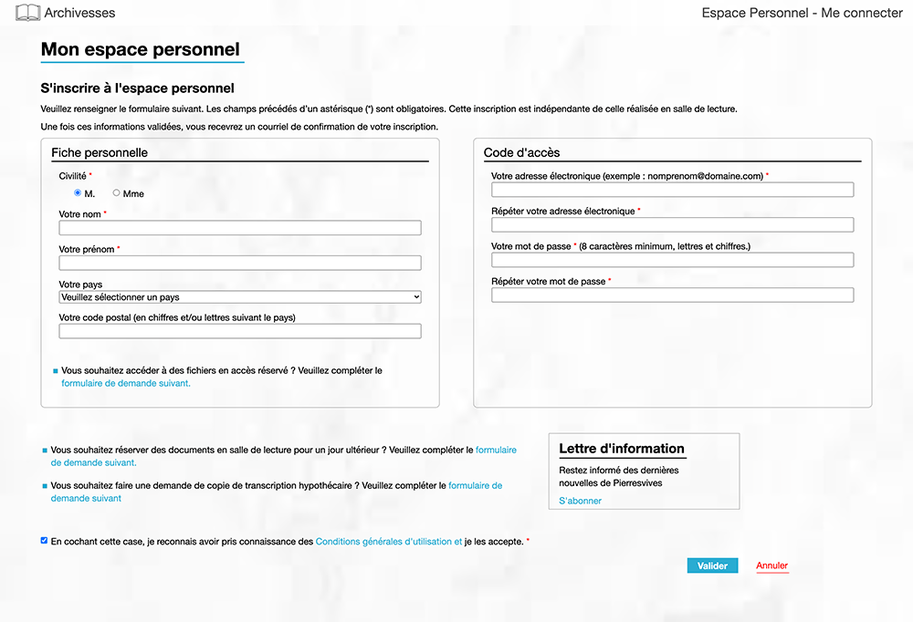
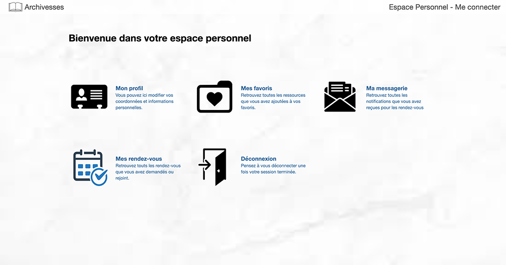
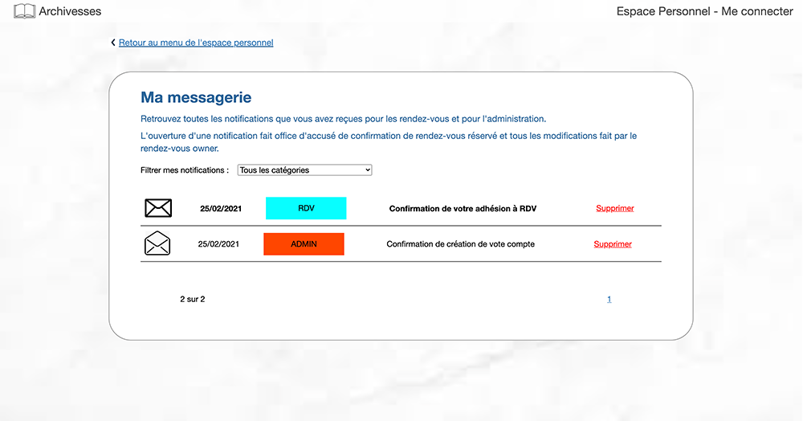
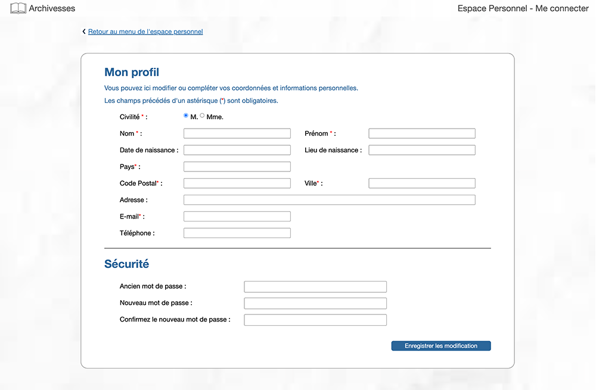
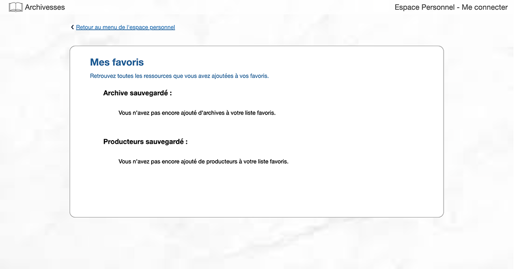
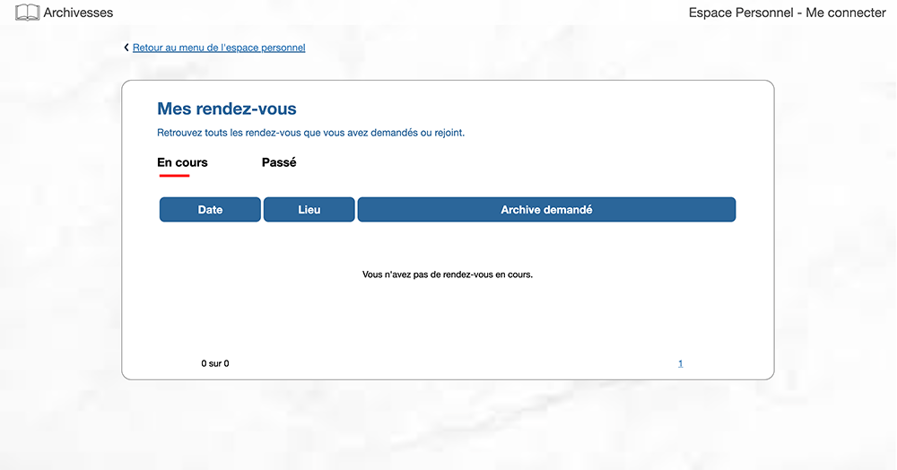
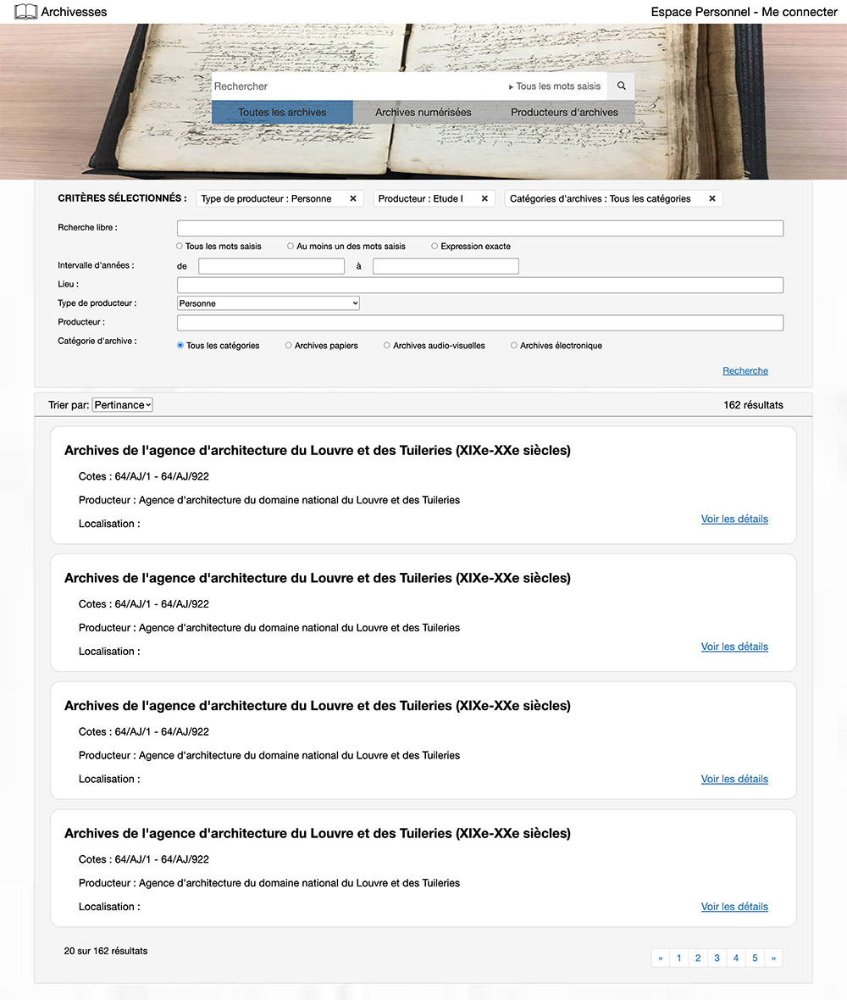

## Done
- welcome: Commence votre visite
- header: Me connecter -> login / Espace Personnel -> self_center
- login: login logic, interaction with database, jump to search page
- search: 
    - Toutes les archives / Archives numérisées / Producteurs d'archives: switch background change
    - Tous les mots saisis: click to show/hide search particle view
    - Recherch / Rendez-vous indicator show/hide when cliced
- self_center:
    - profile / favorites / message_list / reservation / logout click to jump to relevant page
    - logout logic (clear browser session and cache, return to search page)
- message detail
       
## TODO list
- Page
    - Favorites page with data (design - Amy)
    - Reservation page with data (design - Amy)
    - Reservation detail page
    - Change password page (design - Amy)
    - Archive detail page (search result: view detail)
- DB tables need to be modified √


## URLs
```
# can view directly from URL
localhost:8000  ->  welcome.html
localhost:8000/search  ->  search.html
localhost:8000/login  ->  login.html
# can only be used internally by javascripts
localhost:8000/register  ->  register.html
localhost:8000/selfcenter  ->  self_center.html
localhost:8000/profile  ->  profile.html
localhost:8000/favorites  ->  favorites.html
localhost:8000/messagelist  ->  message_list.html
localhost:8000/reservation  ->  reservation.html
localhost:8000/searchresult  ->  search_result.html
localhost:8000/logout  ->  jump to search.html
```

## MySQL settings
- Create database manually in Navicat (database name: web_historien)
- Config MySql connections in web_historien/settings.py  
```python
DATABASES = {  
    'default': {  
        'ENGINE': 'django.db.backends.mysql',  
        'NAME': 'web_historien',  
        'USER': 'root',  
        'PASSWORD': 'root',  
        # Set to empty string for localhost.  
        'HOST': '',  
        # Set to empty string for default.  
        'PORT': '',  
    }  
}
```
- Edit tables in app01/models.py  
<font color=red>**\* Note: Don't use French in db, MySQL will ommit French characters like èéùçà etc.**</font>
- Run the following 2 commands in iTerm or PyCharm Terminal  
<font color=red>**\* Note: This is to auto create tables in MySql db.**</font>
```shell script
$ python3 manage.py makemigrations  
$ python3 manage.py migrate  
```
- Migrate command will also create tables that django needed, like auth_user, django_session etc.  
<font color=red>**\* Remember not to delete these tables.**</font>
  
**\* Note other:**  
- If you create tables from MySQL client(navicat), and want to generate models.py file automatically, use the following command:   
```shell script
$ python3 manage.py inspectdb Users Archive Museum Reservation Res_Dem_Arch > app01/models.py
```

## Screenshots
- Welcom  
- Search  
- login  
- register  
- self_center  
- message_list  
- profile  
- favorites  
- reservation  
- search_result  
